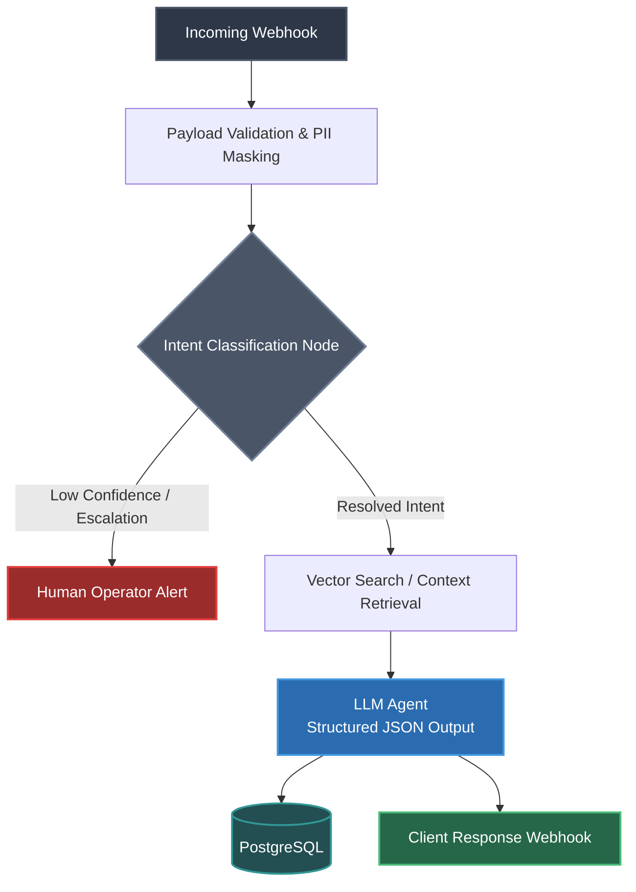

# 🤖 Enterprise AI Support Agent & Workflow Orchestrator

An end-to-end automated customer support pipeline built with **n8n**, **LLM APIs (OpenAI/Anthropic/Meta)**, and relational database storage. 

The system automates multi-tier customer inquiry handling, intent classification, PII sanitization, structured data extraction, and seamless escalation to human operators.

---

---

## 🌟 Key Features

* **Intent Routing Engine:** Dynamically classifies incoming user messages into support categories, technical inquiries, or transactional actions.
* **Deterministic Structured Output:** Enforces strict JSON schemas from LLM nodes for reliable downstream API execution.
* **PII & Data Protection Layer:** Sanitizes and masks sensitive customer data before routing payloads to external LLMs.
* **State & Escalation Management:** Automatically tracks conversation context and triggers seamless handoffs to human agents for high-risk or complex edge cases.
* **Database Synchronization:** Persists conversation logs, user profiles, and session metadata into PostgreSQL / Supabase.
* **Webhook & Error Handling:** Built-in retry mechanisms, payload validation, and instant incident alerting.

---

## 🛠 Tech Stack

* **Workflow Orchestration:** n8n (Self-Hosted)
* **AI & LLMs:** OpenAI API (Meta-LLama-3.3 / Function Calling), OpenAI API
* **Backend & Scripting:** JavaScript (n8n Code Nodes), Python, REST APIs, Webhooks
* **Database Layer:** PostgreSQL, Amazon RedShift
* **Deployment:** Docker, Docker Compose

---

## 📐 Architecture & Workflow Diagram

---

## 🚀 Quickstart & Deployment

### Prerequisites
* Docker & Docker Compose installed
* API Keys for OpenRouter
* Database instance (PostgreSQL)

---

## 🛡 Best Practices & Production Considerations

* **Rate-Limit Resilience:** Custom sleep and batching logic to prevent API throttling during peak traffic.
* **Token Optimization:** Dynamic system prompt injection based on intent categorization to minimize LLM token usage.
* **Auditability:** Complete execution logs stored with trace IDs for easy debugging and analytics.
