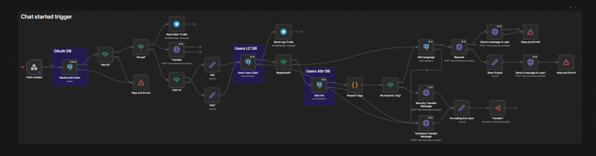
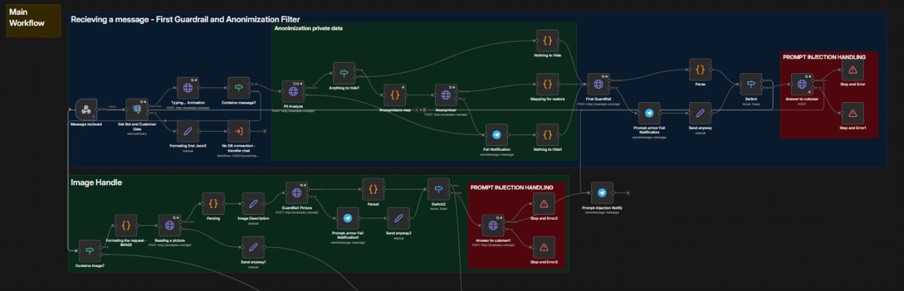
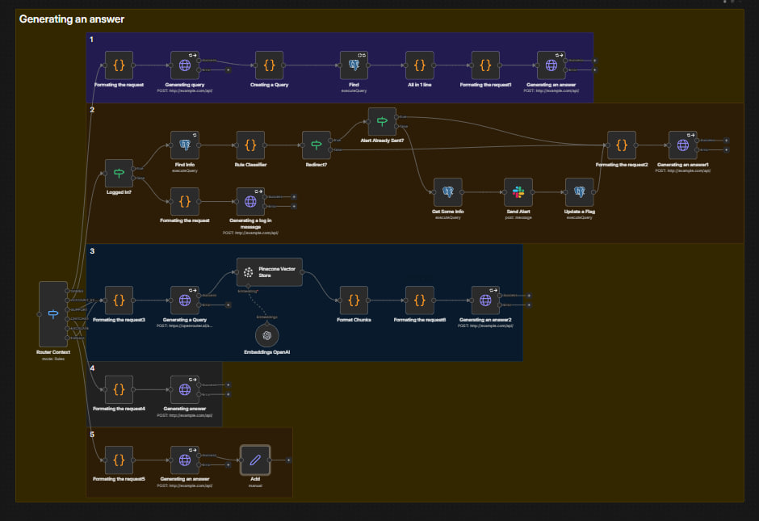
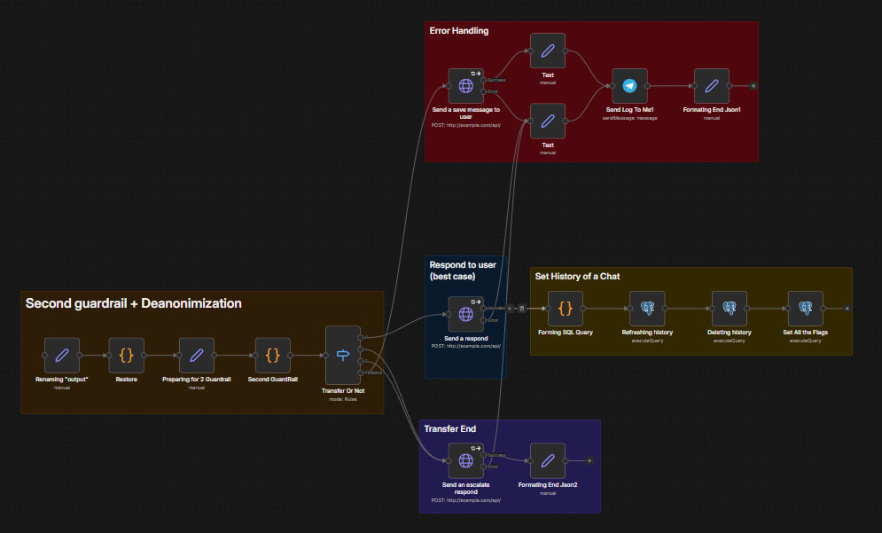

# 🤖 Enterprise AI Support Agent & Workflow Orchestrator

> **Disclaimer:** This repository contains a Proof-of-Concept (PoC) template designed for generic E-commerce and SaaS platforms. All endpoints, APIs, and routing logic shown are abstracted and mocked for demonstration purposes.

An end-to-end automated customer support pipeline built with **n8n**, **LLM APIs**, and relational database storage. 

The system automates multi-tier customer inquiry handling, intent classification, PII sanitization, structured data extraction, and seamless escalation to human operators.

---

## 🌟 Key Features

* **Intent Routing Engine:** Dynamically classifies incoming user messages into support categories, technical inquiries, or transactional actions.
* **Deterministic Structured Output:** Enforces strict JSON schemas from LLM nodes for reliable downstream API execution.
* **PII & Data Protection Layer:** Sanitizes and masks sensitive customer data before routing payloads to external LLMs.
* **State & Escalation Management:** Automatically tracks conversation context and triggers seamless handoffs to human agents for high-risk or complex edge cases.
* **Database Synchronization:** Persists conversation logs, user profiles, and session metadata into relational databases.
* **Webhook & Error Handling:** Built-in retry mechanisms, payload validation, and instant incident alerting.

---

## 🛠 Tech Stack

* **Workflow Orchestration:** n8n (Self-Hosted)
* **AI Engine:** Integration-ready for major LLM providers via API
* **Backend & Scripting:** JavaScript (n8n Code Nodes), REST APIs, Webhooks
* **Database Layer:** PostgreSQL / Vector Databases (e.g., Pinecone)
* **Deployment:** Docker, Docker Compose

---

## 📐 Architecture & Workflow Modules

### 1. Initialization & Authentication
Validates incoming webhooks, checks user authorization, and retrieves customer metadata before processing.

  
  
<i>Fig 1. Chat started trigger and database validation logic.</i>

 

### 2. First Guardrail & Data Anonymization
Intercepts the message to detect and mask Personally Identifiable Information (PII). Also includes prompt injection defenses before any LLM interaction.

  
  
<i>Fig 2. Main workflow handling data sanitization and security guardrails.</i>

 

### 3. Intent Routing & RAG Generation
Routes the sanitized query to the appropriate logic branch (e.g., general FAQ, specific account actions) and uses Vector Store embeddings for context-aware generation.

  
  
<i>Fig 3. Answer generation pipeline with vector search and rule-based routing.</i>

 

### 4. Deanonymization & Error Handling
Restores masked PII safely to the final output, updates the chat history in the database, and manages fallback scenarios or operator transfers.

  
  
<i>Fig 4. Second guardrail, history management, and safe delivery to the user.</i>

---

## 🚀 Quickstart & Deployment

### Prerequisites
* Docker & Docker Compose installed
* n8n instance (Cloud or Self-hosted)
* PostgreSQL database instance
* Vector Store API credentials

### Installation
1. Clone this repository.
2. Import the `.json` workflow files into your n8n workspace.
3. Update the HTTP Request nodes with your specific environment URLs and API keys.
4. Configure your database credentials in the global n8n variables.

---

## 🛡 Best Practices & Production Considerations

* **Rate-Limit Resilience:** Custom sleep and batching logic to prevent API throttling during peak traffic.
* **Token Optimization:** Dynamic system prompt injection based on intent categorization to minimize LLM token usage.
* **Auditability:** Complete execution logs stored with trace IDs for easy debugging and analytics.
